# SkillGraph AI – Adaptive Learning Path Engine (Foundation)

SkillGraph AI is a scalable, production-ready adaptive learning path engine that maps user profile skills against career goals, performs gap analyses, and builds adaptive paths.

This repository houses the **production-ready foundation** (Phase 1) featuring clean architecture, strict database schema models (PostgreSQL + Prisma), secure authentication (JWT with automatic refresh), and structured logging.

---

## Folder Structure

```text
SkillGraph/
├── docker-compose.yml         # Dev/Prod docker orchestration
├── .env.example               # Root environments info
├── backend/                   # Backend Express.js Server
│   ├── Dockerfile             # Production multi-stage Docker build
│   ├── .env.example           # Backend environment configuration
│   ├── nodemon.json           # Nodemon configuration
│   ├── package.json           # Backend dependencies and scripts
│   ├── tsconfig.json          # Strict TypeScript config
│   ├── prisma/
│   │   ├── schema.prisma      # Relational schemas & enums
│   │   └── seed.ts            # Seed script (3 users, 20 skills, 20 edges, 2 goals)
│   └── src/
│       ├── app.ts             # Express app setup with middlewares
│       ├── server.ts          # HTTP server entry & graceful shutdown
│       ├── config/            # Database connect, logger (Pino), Env schema
│       ├── controllers/       # HTTP Request/Response validation layers
│       ├── middleware/        # JWT validation, Role-based authorization, Rate limiters, Error handling
│       ├── repositories/      # Database access layers (Prisma wrappers)
│       ├── services/          # Pure business logic layers
│       ├── types/             # Common types, enums, express overrides
│       ├── utils/             # ApiError, ApiResponse, asyncHandler, hashPassword
│       └── validators/        # Zod validation schemas
└── frontend/                  # React 19 + Vite Frontend
    ├── tailwind.config.js     # Tailwind CSS configuration
    ├── postcss.config.js      # PostCSS configuration
    ├── package.json           # Frontend dependencies and scripts
    ├── index.html             # Entry point
    └── src/
        ├── App.tsx            # Main app router / provider registration
        ├── index.css          # Tailwind imports & customized design system
        ├── main.tsx           # React bootstrap mount
        ├── api/               # Axios apiClient & specific modules (auth, skills)
        ├── components/        # ProtectedRoute wrapper
        ├── contexts/          # Auth context with token automatic restore
        ├── hooks/             # useAuth convenience hooks
        ├── layouts/           # Auth layout & Dashboard layouts
        ├── pages/             # Login, Register, Dashboard, Skills, Career Goals
        └── types/             # Shared TypeScript types matching API schema
```

---

## Database Schema

```mermaid
erDiagram
    users {
        uuid id PK
        varchar(100) name
        varchar(255) email UK
        varchar(255) password
        role role
        timestamp created_at
        timestamp updated_at
    }
    skills {
        uuid id PK
        varchar(200) name UK
        varchar(100) category
        text description
        difficulty difficulty
        timestamp created_at
        timestamp updated_at
    }
    skill_edges {
        uuid id PK
        uuid parent_skill_id FK
        uuid child_skill_id FK
    }
    progress {
        uuid id PK
        uuid user_id FK
        uuid skill_id FK
        float mastery
        status status
        timestamp updated_at
    }
    career_goals {
        uuid id PK
        varchar(200) name UK
        text description
    }

    users ||--o{ progress : "tracks"
    skills ||--o{ progress : "includes"
    skills ||--o{ skill_edges : "parent_of"
    skills ||--o{ skill_edges : "child_of"
```



### Models & Constraints
- **User**: Contains login details and user roles (`ADMIN` or `USER`). Indexed on `email`.
- **Skill**: Contains skills grouped by category and graded by difficulty (`BEGINNER`, `INTERMEDIATE`, `ADVANCED`). Indexed on `category` and `difficulty`.
- **SkillEdge**: Directed graph edges representing skill dependency. A child skill depends on a parent skill.
- **Progress**: Mastery metrics (0.0 to 100.0) and status tracking (`NOT_STARTED`, `IN_PROGRESS`, `COMPLETED`).
- **CareerGoal**: Target jobs or milestones (e.g. "Full-Stack Web Developer").

---

## API List

All API endpoints are prefixed with `/api/v1` and validate request bodies using Zod schemas.

| Method | Endpoint | Auth | Description |
|:---|:---|:---|:---|
| **POST** | `/auth/register` | Public | Register new user. Returns user info + access & refresh token. |
| **POST** | `/auth/login` | Public | Authenticate credentials. Returns user info + tokens. |
| **POST** | `/auth/logout` | JWT | Logout and invalidate session. |
| **POST** | `/auth/refresh` | Public | Generate new token pair using a valid refresh token. |
| **GET** | `/users/profile` | JWT | Fetch authenticated user details. |
| **GET** | `/skills` | JWT | List skills (paginated, supports filter by category). |
| **GET** | `/skills/categories` | JWT | Fetch distinct list of skill categories. |
| **GET** | `/career-goals` | JWT | List all available career goals. |
| **POST** | `/career-goals/select`| JWT | Select and bind a career goal to the current user profile. |

---

## Installation & Running Locally

### Prerequisites
- Node.js >= 18
- Docker and Docker Compose

### 1. Configure Environments
Copy the example files and update any credentials:
```bash
cp backend/.env.example backend/.env
cp .env.example .env
```

### 2. Start PostgreSQL Container
Spin up the local database using docker-compose:
```bash
docker-compose up -d postgres
```

### 3. Setup Database (Prisma)
Navigate to backend, install packages, generate Prisma Client, run migrations, and seed:
```bash
cd backend
npm install
npx prisma migrate dev --name init
npx prisma db seed
```

This seeds:
- **1 Admin Account**: `admin@skillgraph.ai` (password: `Password123!`)
- **2 User Accounts**: `alex@example.com`, `jordan@example.com` (password: `Password123!`)
- **20 Skills & 20 Directed Graph Edges**
- **2 Career Goals**

### 4. Run Development Servers

**Start Backend Dev Server:**
```bash
# inside /backend
npm run dev
```

**Start Frontend Dev Server:**
```bash
cd ../frontend
npm install
npm run dev
```
Open `http://localhost:5173` to interact with the UI.

---

## Future Roadmap
- **Phase 2: Knowledge Graph Engine** — Implement React Flow interactive layout, DFS/BFS graph traversals, and edge validation in database.
- **Phase 3: Skill Gap Analysis** — Calculate mastery gap between current skills and the target career goal requirements.
- **Phase 4: Adaptive Learning Paths** — Generate dynamic learning roadmaps using Dijkstra / topological sorting algorithms.
- **Phase 5: AI Micro Lessons & Resume Skill Extraction** — OpenAI/Claude API integration to extract skills from PDF resumes and generate micro lessons.

<!-- trigger CI/CD -->

<!-- fix: force backend redeploy with correct CORS and DB settings -->
